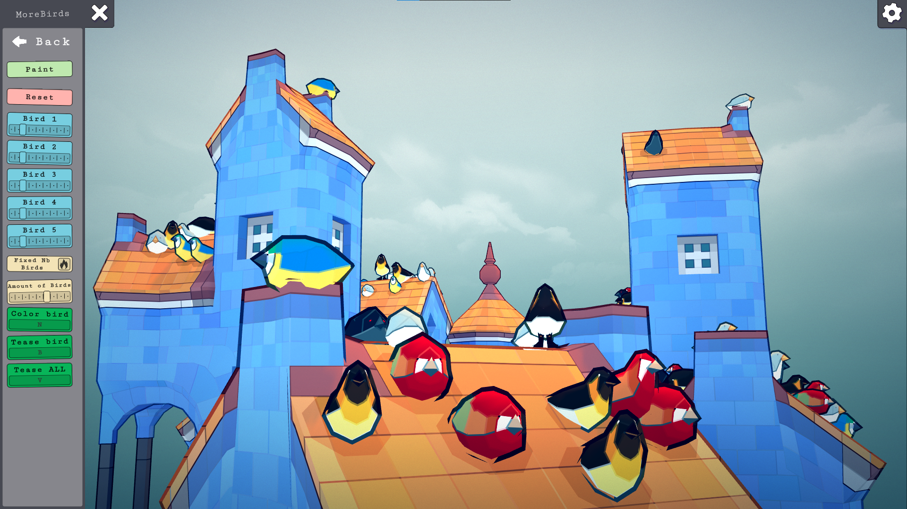
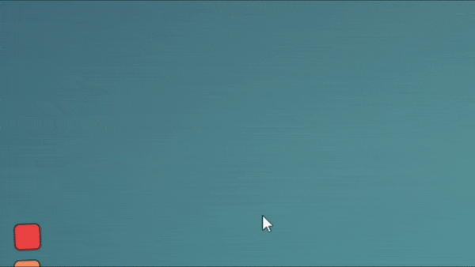
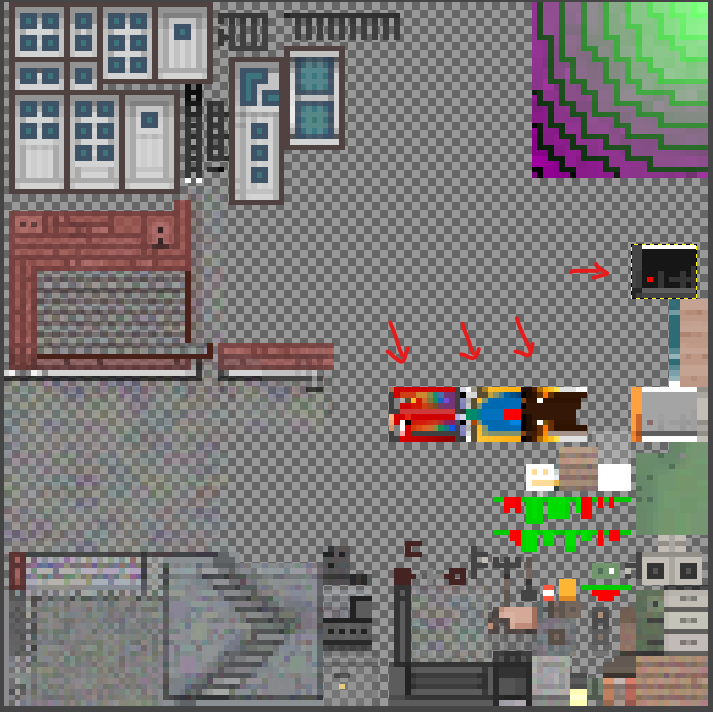

# Townscaper-CustomBirds

:warning: 2022/06/27 : Beware that TextureManager mod does not work very well with CustomBirds mod. Birds with multiple colors might not show up. Will release an update in the near future

Townscaper mod for customizing the texture of the birds, the amount of birds and play with them

# Features

- Up to 5 customizable birds texture (including the original one)
- Control the amount of birds
- Change the texture of birds in real-time with keyboard shortcuts
- Tease them with keyboard shortcuts to make them fly one by one or all together

# Installation

1. Download "Melon Loader" by LavaGang:
https://github.com/LavaGang/MelonLoader/releases/latest/

2. Start the MelonLoader.Installer.exe

2.1. Click "Select" and navigate to your Townscaper folder and select the Townscaper.exe (usually: C:\Program Files(x86)\Steam\steamapps\common\Townscaper\Townscaper.exe)

2.2. :warning: Untick the "Latest" checkbox and choose **version 0.4.3** :warning:

2.3. Click install 

2.4. During the installation a "Mods" folder gets created it your game folder. MelonLoader does not(!) change any game files. 
	 You can uninstall anytime through the installer or by deleting the "version.dll" file.

3. Download the mod (latest release) by clicking [here](https://github.com/mokojm/Townscaper-CustomBirds/releases/download/v0.9.0/BirdMod.zip)

4. Extract all the files from "BirdMod.zip" into your games Mods folder.

5. Copy the "TownColor.png" file included in the downloaded mod in "C:\\Users\\((UserName))\\AppData\\LocalLow\\Oskar Stalberg\\Townscaper\\Textures"

6. Download the utility mod "ModUI" (:warning: latest release published on 2022/06/27 :warning:) from: https://github.com/DigitalzombieTLD/TownscaperModUI/releases/latest/

7. Extract all files from the ModUI download into your games Mods folder

8. Start the game !

9. The menu can be found here :

# Details

The original texture file "TownColor.png" contains only one place for changing birds texture. So the new one included in this mod contains 4 more locations you can modify. The other textures have been kept the same.

To change keyboard shortcuts, you need to click on them, then tap the new keyboard shortcut then click "Apply"

# Credits

Thanks you to Oskar Stalberg for [Townscaper](https://store.steampowered.com/app/1291340/Townscaper/)

Thank you to [Sem](https://sem-from-france.carrd.co/) and Andrej for the bird patterns 

Thanks to:
LavaGang for MelonLoader

ThirdParty  code:
Il2Cpp Asset Bundle Manager
https://github.com/LavaGang/UnityEngine.Il2CppAssetBundleManager
Licensed under the Apache License, Version 2.0

ModUI by Digitalzombie
https://github.com/DigitalzombieTLD/TownscaperModUI
Licensed under the Apache License, Version 2.0

CustomBirds mod is licensed under Apache License, Version 2.0
